# Pusher Realtime Chat Example

The goal of this project is to show step-by-step how to build
a realtime chat application with [Pusher][pusher] and [Ruby on Rails][rails].

## Prerequisites

- [RVM](http://rvm.io/)
- [Rails][rails]
- [Git](http://git-scm.com/)

## Getting Started

```bash
$ cd ~/your-project-folder

# Create a gemset named pusher-realtime-chat-example
$ rvm use 2.1.1@pusher-realtime-chat-example --create

$ gem install rails
$ rails new pusher-realtime-chat-example --skip-test-unit

$ cd pusher-realtime-chat-example

# Create the .ruby-version and .ruby-gemset files so that
# whenever you return to the project directory it will
# automatically use the correct Ruby version and gemset
$ rvm use 2.1.1@pusher-realtime-chat-example --ruby-version

$ bin/rails s
```

Now open your browser and navigate to http://localhost:3000. If  everything was
set up correctly you'd see the "Welcome aboard" page as shown below.

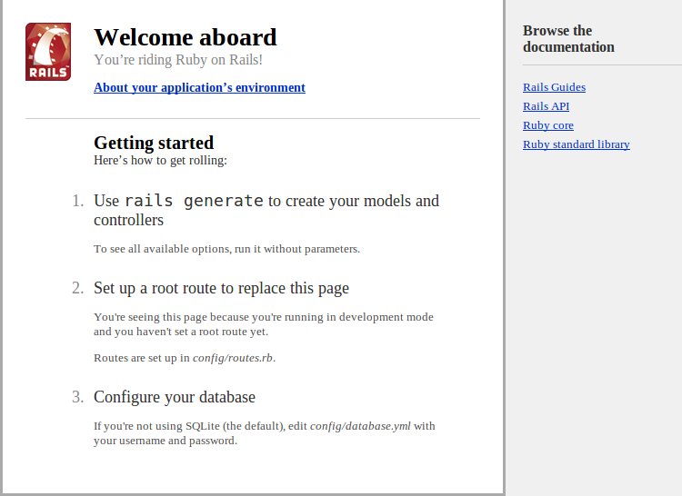

Great! Let's commit.

```bash
$ git init
$ git add .
$ git commit -m "Initial commit"
```

## Iteration 1

```bash
# Create a new branch named iteration-1 and switch into it
git checkout -b iteration-1
```

I find it helpful to approach problems I've never tackled before in many small
iterations until I reach the final result. Each iteration should get me one or
more steps closer to the outcome I want to achieve.

In this iteration I want the user to be able to enter their name and a message
into a form and be able to send that information to the server for "processing".
The details are intentionally vague to leave room for architectural design and
development freedom.

Open your `config/routes.rb` file and add the following:

```ruby
root 'chat_messsages#index'
```

If we now start our server

```bash
$ bin/rails s
```

and navigate to http://localhost:3000 we'd see the following page:

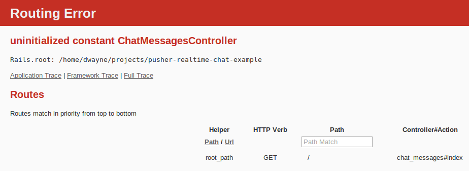

Let's add the `ChatMessagesController`.

Navigating to http://localhost:3000 we get:

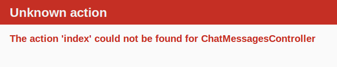

Let's add an empty `index` action and add the view `app/views/chat_messages/index.html.erb`
one time. Within the view file we'd start building out the form.

```html
<%= form_for @chat_message do |f| %>
  <div>
    <%= f.label :name %>
    <%= f.text_field :name %>
  </div>

  <div>
    <%= f.label :message %>
    <%= f.text_area :message, rows: 5, cols: 40 %>
  </div>

  <div>
    <%= f.submit 'Send' %>
  </div>
<% end %>
```

Reloading the page we encounter an error with `@chat_message` not being set.

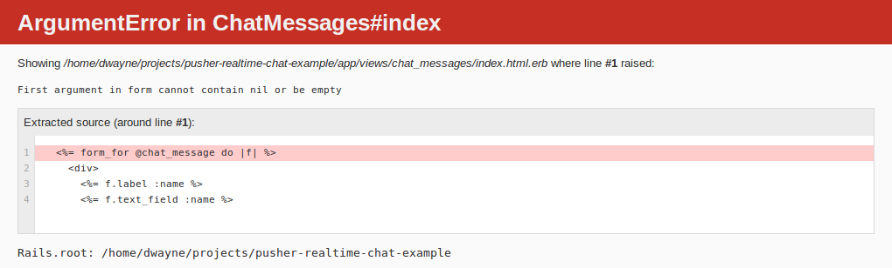

To fix that we can make the following changes:

```ruby
# app/controllers/chat_messages_controller.rb

def index
  @chat_message = ChatMessage.new
end
```

and

```ruby
# app/models/chat_message.rb

class ChatMessage
  include ActiveModel::Model
  attr_accessor :name, :message
end
```

I chose not to inherit from [`ActiveRecord::Base`](http://api.rubyonrails.org/classes/ActiveRecord/Base.html)
since I don't need persistence. However, I do need it to work with [`form_for`][form_for]
hence the [`ActiveModel::Model`](http://api.rubyonrails.org/classes/ActiveModel/Model.html)
mixin.

That fixes the previous error but we have a new problem:

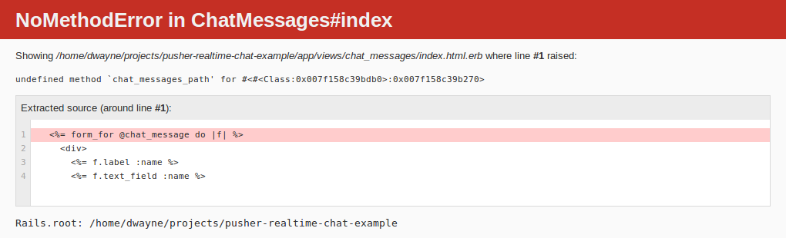

By default the [`form_for`][form_for] we set up sends a `POST` request to
`/chat_messages`. Therefore we will have to set up a route and a corresponding
action to handle the request.

```ruby
# config/routes.rb

resources :chat_messages, only: [:create]
```

and

```ruby
# app/controllers/chat_messages_controller.rb

def create
end
```

With that, the page now shows. Before continuing let's clean up the look a bit
by placing each label on a separate line.

```bash
$ rm app/assets/stylesheets/application.css
$ touch app/assets/stylesheets/application.css.scss
```

```scss
// app/assets/stylesheets/application.css.scss

#new_chat_message label {
  display: block;
}
```

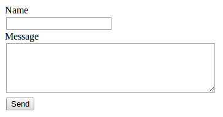

I know, it looks amazing.

Let's try filling out the form and submitting it to see what happens.

We get:

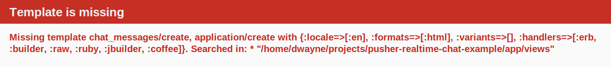

[Rails][rails] is trying to render the view `app/views/chat_messages/create`, but that's not what we want to happen. In fact, what we truly want to happen will take a couple more iterations so in the meantime let's just redirect to the home page and end this iteration.

```ruby
# app/controllers/chat_messages_controller.rb

def create
  redirect_to root_url
end
```

**Note:** We are indeed getting the form data as shown in the logs.

```
# log/development.log

Started POST "/chat_messages" for 127.0.0.1 at 2014-05-29 05:53:57 -0400
Processing by ChatMessagesController#create as HTML
  Parameters: {"utf8"=>"✓", "authenticity_token"=>"w6f575YP/clgPpVBG4YnXBeNx0VEFxUasAjdFFFKto8=", "chat_message"=>{"name"=>"Dwayne", "message"=>"Hello, world!"}, "commit"=>"Send"}
Redirected to http://localhost:3000/
Completed 302 Found in 1ms (ActiveRecord: 0.0ms)
```

## Iteration 2

```bash
# Merge the previous work into master
$ git checkout master
$ git merge iteration-1

# Create a new branch named iteration-2 and switch into it
$ git checkout -b iteration-2
```

In this iteration all we want to do is get the message submitted by the user to
appear on the same page that the user used to submit the message. The page
should not be refreshed.

Based on these requirements we will need to submit the form via [Ajax](ajax)
and have the server send a response that places a view of the message on the
page.

To submit the form via [Ajax][ajax] we simply need to change the `form_for` to:

```html
<!-- app/views/chat_messages/index.html.erb -->

<%= form_for @chat_messages, remote: true do |f| %>
```

**Note:** Many things are happening in that single line above and so I'd suggest
you read [Working with JavaScript in Rails](http://guides.rubyonrails.org/working_with_javascript_in_rails.html)
to fully understand the implication of adding `remote: true`.

If we now fill out the form and try to send a message it appears that nothing
happens. However, by looking at the logs we see that our form is being
processed by [Rails][rails] as `JS` rather than as `HTML`.

```
# log/development.log

Started POST "/chat_messages" for 127.0.0.1 at 2014-05-29 07:38:57 -0400
Processing by ChatMessagesController#create as JS
  Parameters: {"utf8"=>"✓", "chat_message"=>{"name"=>"Dwayne", "message"=>"Hello, world!"}, "commit"=>"Send"}
Redirected to http://localhost:3000/
Completed 302 Found in 1ms (ActiveRecord: 0.0ms)


Started GET "/" for 127.0.0.1 at 2014-05-29 07:38:57 -0400
Processing by ChatMessagesController#index as JS
  Rendered chat_messages/index.html.erb within layouts/application (1.2ms)
Completed 200 OK in 6ms (Views: 5.5ms | ActiveRecord: 0.0ms)
```

If we look at the `Network` tab in the [Chrome DevTools][chrome_devtools] we'd
see that the request is being sent as an `XMLHttpRequest` or `xhr` request.

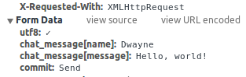

Great! Let's handle the request by responding appropriately.

```ruby
# app/controllers/chat_messages_controller.rb

def create
  @chat_message = ChatMessage.new(params[:chat_message])

  respond_to { |format| format.js }
end
```

If we go back to the form and try to send a message, then still nothing appears
to happen. However, we're now getting the following error messages if we view
the `Network` tab in [Chrome DevTools][chrome_devtools].

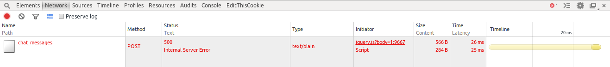

And on a deeper inspection:


We fix it by creating the file `app/views/chat_messages/create.js.erb` with the
content:

```js
// app/views/chat_messages/create.js.erb

alert('<%= @chat_message.name %> says <%= @chat_message.message %>');
```

Fantastic! We now get an alert message telling us exactly what we said.

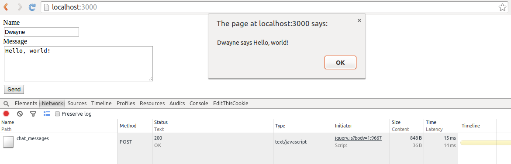

To round off this iteration we need to render the message within the page and
not in an alert box. The following changes do just that.

Firstly, add an area to the page for displaying the chat messages.

```html
<!-- app/views/chat_messages/index.html.erb -->

<ul class="chat_messages"></ul>
```

Then, add a partial for rendering an individual chat message.

```html
<!-- app/views/chat_messages/_chat_message.html.erb -->

<li><%= chat_message.name %> says <%= chat_message.message %></li>
```

And finally, place the chat message within the messages area.

```js
// app/views/chat_messages/create.js.erb

// clear the message box
$('#chat_message_message').val('');

// show the message in the messages area
$('.chat_messages').prepend('<%= escape_javascript(render @chat_message) %>');
```

This completes iteration 2.

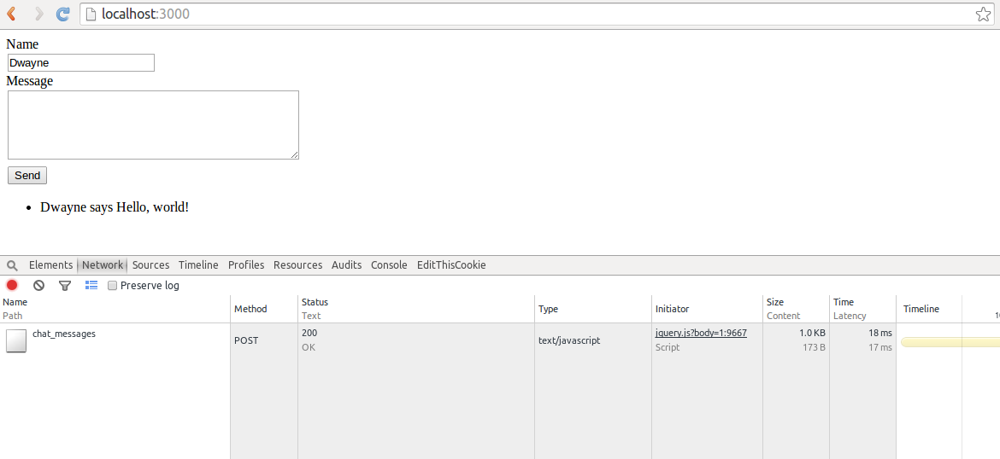

[pusher]: http://pusher.com/
[rails]: http://rubyonrails.org/
[form_for]: http://api.rubyonrails.org/classes/ActionView/Helpers/FormHelper.html#method-i-form_for
[ajax]: https://developer.mozilla.org/en/docs/AJAX
[chrome_devtools]: http://discover-devtools.codeschool.com/
